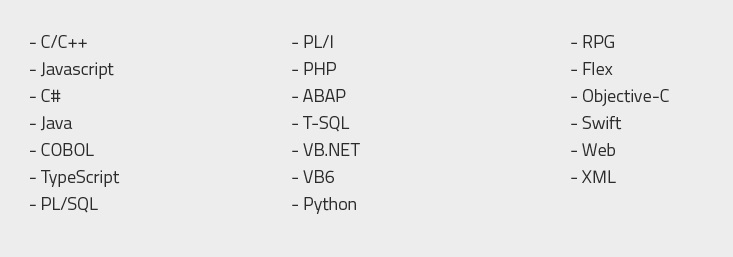
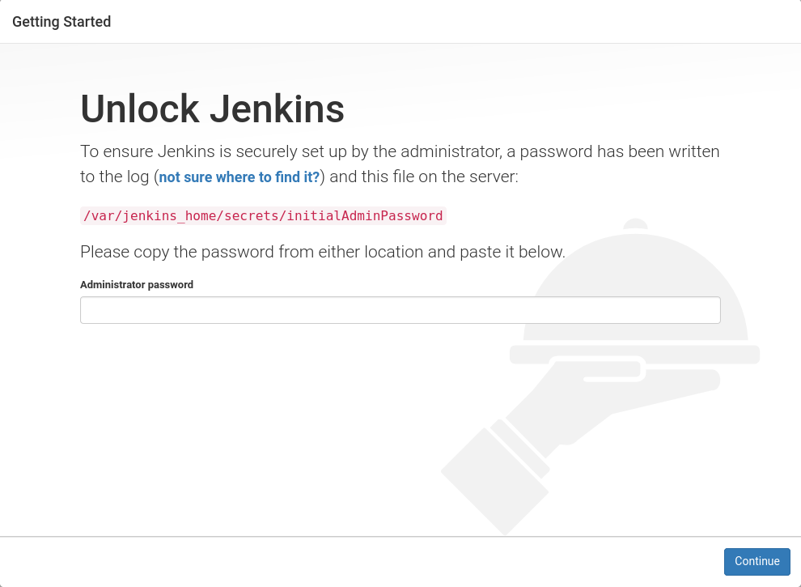
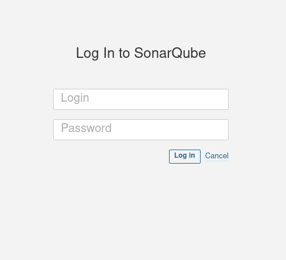
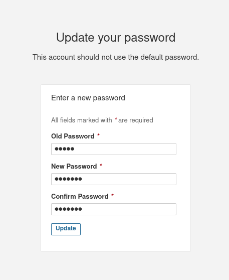
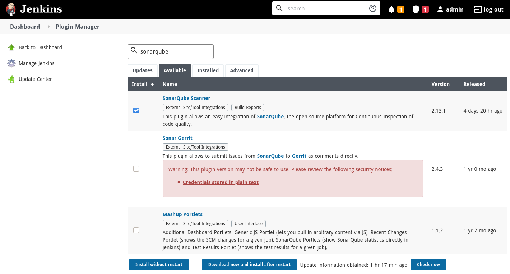
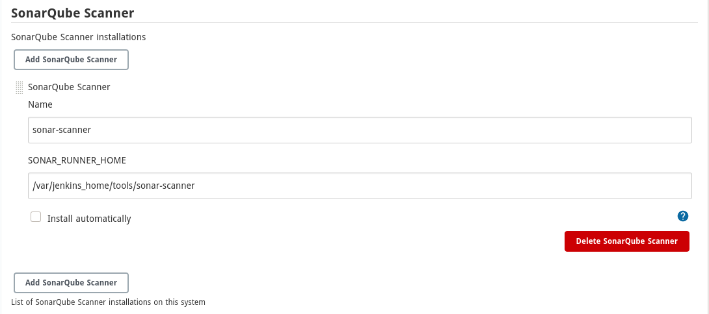
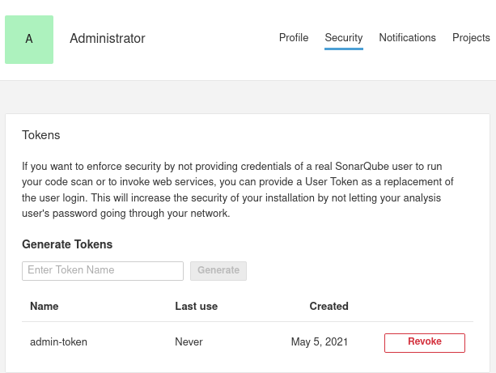
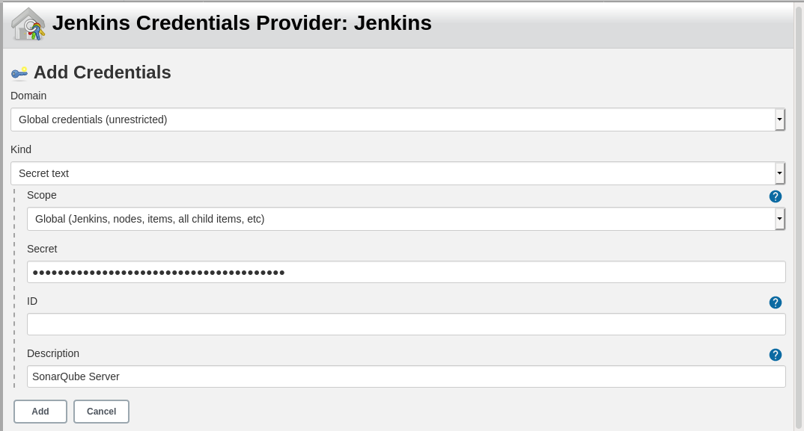
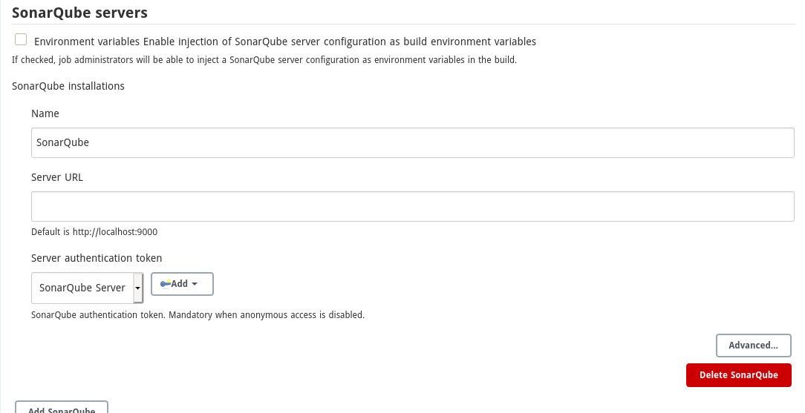

# Proyecto Jenkins
Autores: Christian Manalo y Mark Santiago

---

## Objetivo

- Sistema automatizado de integración continua con **Jenkins**.
- Códigos provenientes de **Git** evaluados con **Sonarqube** para saber la calidad de código.

---

## Infraestructura


- **Instancia AWS**
- **Docker**
- **Volúmenes**

---


## Jenkins


### Caracteristicas
* **Instalación sencilla**

* **Configuración sencilla**

* **Plugins disponibles**

* **Extensible**

* **Distribución**

* **Free Open Source**


---

## Sonarqube


- **Lenguajes disponibles:**



- **Herramientas Sonarqube**


---

## Instalación




```
*************************************************************
*************************************************************
*************************************************************

Jenkins initial setup is required. An admin user has been created and a password generated.
Please use the following password to proceed to installation:

87396ae5e3c449adb588f0401804924a

This may also be found at: /var/jenkins_home/secrets/initialAdminPassword

*************************************************************
*************************************************************
*************************************************************
```




---


---


---


---


---



---



### Pipeline

```java
def listusers = "alumne1 alumne2 alumne3"
def user = listusers.split(" ")

pipeline {
    agent any
    stages {
        stage ('Clone repositories'){
            steps {
                script {
                    for (i in user) {
                        def exists = fileExists "${i}"
                        if (!exists){
                            new File("${i}").mkdir()
                            dir ("${i}") {
                            git url: "https://gitlab.com/2daw2020/${i}"
                            }
                        }
                        else {
                            dir ("${i}"){
                                sh "git pull origin master"
                            }
                        }
                    }
                }
            }
        }
        stage ('Analysis'){
            environment {
                SCANNER_HOME = tool 'SonarQube'
            }
            steps {
                withSonarQubeEnv(installationName: 'SonarQube', credentialsId: 'sonarqube-token'){
                    script {
                        for (i in user){
                            sh """
                                ${SCANNER_HOME}/bin/sonar-scanner -Dsonar.projectKey=${i} \
                                -Dsonar.projectName=${i} \
                                -Dsonar.sources=/var/jenkins_home/workspace/${env.JOB_NAME}/${i} \
                                -Dsonar.host.url=http://3.213.6.243:9000  \
                                -Dsonar.scm.disabled=true
                            """                    
                        }
                    }                        
                }
            }
        }
    }
}
```


## Mantenimiento
- **Actualización de la imagen jenkins**
- **Añadir nuevos repositorios**

---

## Cosas a mejorar
- **Output Mail**
- **Detectar los commits y se ejecute automáticamente**
- **Detectar plagios**

---

## Conclusiones

---

## FIN

Gracias por vuestra atención!