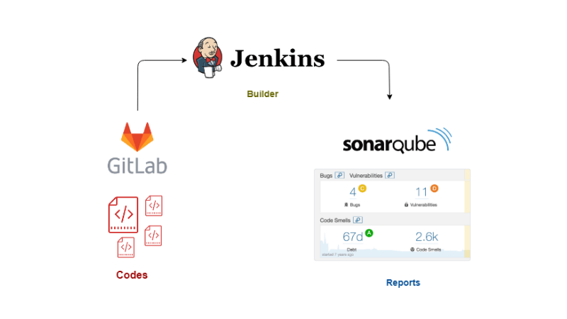
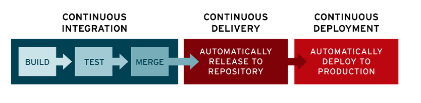

### Objetivo

- Sistema automatizado de integración continua con **Jenkins**.
- Códigos provenientes de **Git** evaluados con **Sonarqube** para saber la calidad de código.

### Infraestructura
---

- Instancia AWS
- Docker
- Volúmenes

---

### Jenkins

#### Que es?

#### CI/CD

- CI: Continuous Integration
- CD: Continuous Deployment.

La CI/CD es un método para distribuir aplicaciones a los clientes mediante el uso de la automatización en las etapas del desarrollo de aplicaciones:

- Integración continua
- Distribución continua
- Implementación continua

#### ETAPAS CI/CD

#### Caracteristicas

---

### Sonarqube

---

### Integración Jenkins, Sonarqube y Git

---

### Pipeline Jenkins

---

### Parametros Sonarqube

---

### Mantenimiento

---

### Cosas a mejorar

---

### Conclusiones

---
